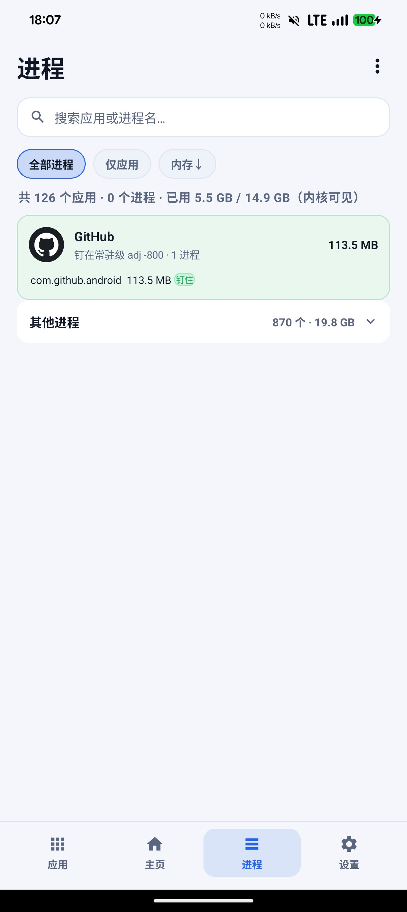

简体中文 | [English](README_en.md)

基于 **LSPosed / Xposed** 的 Android 后台保活模块，主要面向 **LineageOS（AOSP 系）**。它在 `system_server` 进程内部拦截系统的杀进程行为，让选定的应用不被低内存杀手（LMK）或「强行停止」杀掉。

# 进程保活（ProcessKeepAlive）

> 项目主页：https://github.com/Guys222/ProcessKeepAlive

> ⚠️ 仅限个人设备、自己安装的应用使用。保活会让应用持续占用内存与电量，请勿用于追踪、监控他人设备。

## 安装

在 LSPosed Manager 中搜索「进程保活」安装，或从
[Releases](https://github.com/Guys222/ProcessKeepAlive/releases) 下载
`ProcessKeepAlive-v3.3.0-release.apk`（已用项目专用 keystore 签名，可直接覆盖安装）。

启用后**必须**在 LSPosed 中把作用域勾上「**系统框架（android）**」——所有钩子都注入
`system_server`，不勾这一项模块不工作。

> 可选：同时勾选「本模块」仅用于 App 主页「模块激活状态」的实时检测，不勾不影响保活。

## 界面

底部四页导航：**主页 / 应用 / 进程 / 设置**，支持深色 / 浅色 / 跟随系统三种主题，附带 4×1 桌面小部件。

| 主页 | 应用 | 进程 | 设置 |
| --- | --- | --- | --- |
|  |  |  |  |

- **主页** — 模块激活状态、Bento 概览（守护中 / 运行中 / 消息保活）、24 小时存活曲线（可下钻到单个应用）、守护事件时间线
- **应用** — 搜索与勾选目标应用，每个应用显示真实存活时长与「被杀 / 拉起」次数
- **进程** — system_server 视角的实时进程看板（pid / 状态 / oom_adj / RSS / 运行时长），支持杀进程与导出快照
- **设置** — 各保活能力开关、优先级档位、常驻通知、配置备份与恢复

## 它能做什么

| 能力 | 说明 | 默认 |
| --- | --- | --- |
| 降低 OOM Adj | 把目标进程优先级压低到「可见级」，LMK 不优先杀它 | 开 |
| 阻止强制停止 | 拦截 `forceStopPackage`，设置里的「强行停止」失效（**保进程**） | 开 |
| 阻止后台杀死 | 拦截 `killBackgroundProcesses`（**保进程**） | 开 |
| 强力模式 | 拦截 `ProcessRecord.kill` / `killPackageProcessesLocked`（**保进程·激进**） | 关 |
| 常驻实验 | 把目标进程标记为 `persistent`，被杀后自动重启（**保进程·兜底**） | 关 |
| 消息保活 | Doze/Standby 豁免 + 伪装前台防断连（**保进程**，顺带让界面不被回收） | 关 |
| 页面保活 | 伪装进程为前台 TOP，系统不回收其 Activity（**保页面**） | 关 |
| 开机自启动 | 重启后自动拉起已勾选的应用（system_server 内拉起，绕过后台限制） | 关 |

> **「保进程」和「保页面」是两件事。**
> 除「页面保活」外，所有开关只保证**进程不被杀**——应用回到前台时，界面（Activity）仍可能被
> 系统回收并重新加载，这是 Android 的正常行为。
>
> 「页面保活」通过把进程伪装成前台 TOP 来阻止系统回收 Activity，**只对"由系统主动回收页面"
> 的 ROM 有效**。若应用自己主动调用了 `finish()` 重建界面（如部分 App 检测到后台超时后主动
> 重启自己的页面），框架层面拦不住，此时页面依然会重载。页面能否完整恢复也取决于应用自身
> 有没有保存状态。

## 原理（钩子点）

全部注入 `system_server`（包名 `android`）：

- `ActivityManagerService.forceStopPackage`
- `ActivityManagerService.killBackgroundProcesses`
- `ActivityManagerService.killPackageProcessesLocked`
- `OomAdjuster.computeOomAdjLocked`（Android 11+；老版本回退 `updateOomAdjLocked`）
- `ProcessRecord.kill`
- `ActivityManagerService.newProcessRecordLocked`（常驻实验）
- `ActivityManagerService.finishBooting`（开机自启动）

OOM Adj 只「下调、不上调」：绝不会把正在前台运行的进程优先级调高，避免误伤。

## 重要提示

- **保活不影响应用更新**（v3.3.0 起）：安装/更新前系统必然调用 `forceStopPackage`，
  模块已对安装、替换、卸载以及 root/shell 调用自动放行，不会再出现「保活后装不上新版」。
- **LineageOS 本身不像 MIUI/ColorOS 那样激进杀后台**，本模块主要解决「内存紧张时被 LMK 杀掉」
  和「被强行停止」两类场景，效果不像在国产 ROM 上那么戏剧化。
- **常驻实验有风险**：可能让应用在卸载/更新时异常、崩溃后无限重启、增加耗电，默认关闭。
- **常驻通知需要通知权限**：Android 13+ 首次开启会申请 `POST_NOTIFICATIONS`。
- **Doze/待机**：对开启「消息保活」的应用会自动豁免省电白名单与 App Standby 限流。
- 修改任意设置后约 30 秒自动热刷新，无需重启；长时间不生效再重启系统。

## 验证

```bash
adb logcat -s ProcessKeepAlive                 # 查看模块日志
adb shell "ps -A | grep com.example.app"       # 确认进程存活
adb shell "cat /proc/<pid>/oom_score_adj"      # 值越低越不容易被杀
```

## 更新日志

### v3.3.0（versionCode 3）

- **全新界面**：重做为完整应用，底部四页导航「主页 / 应用 / 进程 / 设置」。
- **主页仪表盘**：激活状态、Bento 概览、**24 小时存活曲线**（自绘折线，可点应用图标下钻）。
- **进程页**：按应用分组展示 `pid / 状态 / oom_adj / RSS / 运行时长`，支持杀进程与导出快照。
- **守护事件时间线**：倒序记录「被杀 / 拉起 / 开机拉起」三类事件。
- **配置备份与恢复**、**常驻通知**、**4×1 桌面小部件**、**深色模式**。
- **页面保活**：新增开关，把进程伪装为前台以阻止系统回收 Activity。
- **修复**：保活应用无法安装/更新的问题（对安装与 root/shell 调用放行）。
- 版本号重置为「versionCode-versionName」小号方案（**3-3.3.0**）；此前装过 4000/4001 测试版的用户需手动重装一次。

### v3.2.2（versionCode 33）

- 包名由 `com.processkeepalive` 改为 `io.github.guys222.processkeepalive`。已装旧版的用户
  升级后会被视为新模块，需重新勾选作用域并重启。

## 打赏

如果这个模块帮到了你，欢迎给个 Star ⭐


## 许可

本项目仅供个人学习与自用设备使用。
