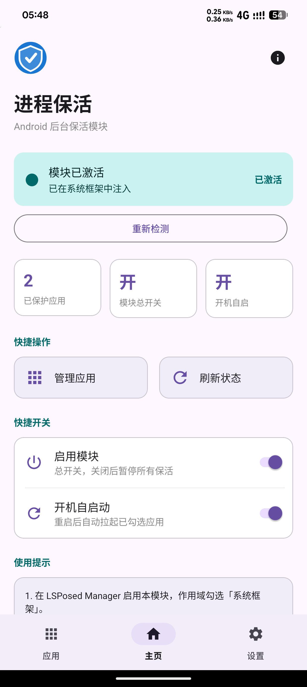
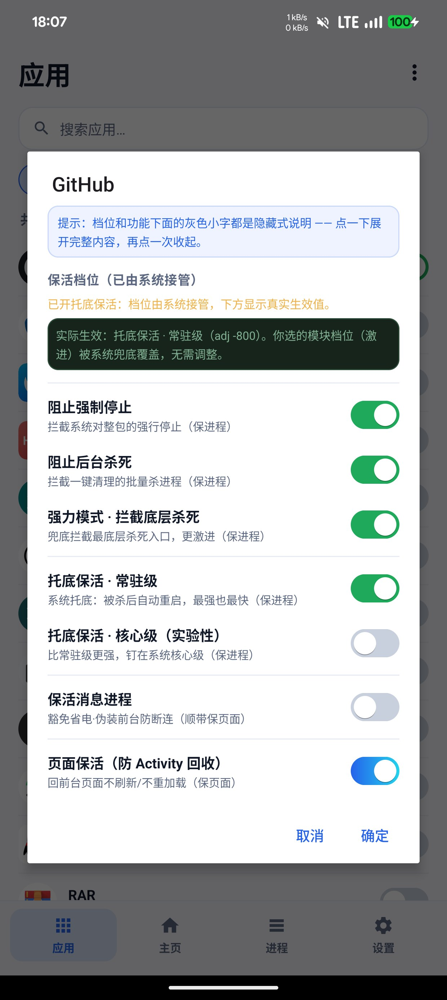
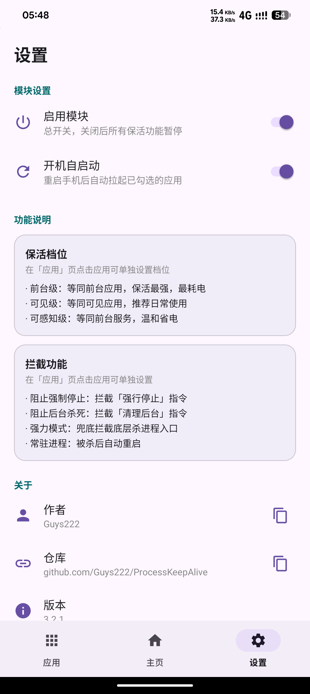

[简体中文](README.md) | English

# ProcessKeepAlive (进程保活)

> Project home: https://github.com/Guys222/ProcessKeepAlive

An LSPosed / Xposed-based Android background keep-alive module, mainly targeting **LineageOS (AOSP-based)** ROMs. It hooks into `system_server` to intercept the system's kill behaviour, so selected apps are not killed by the Low Memory Killer (LMK) or by "Force stop".

> ⚠️ For personal devices and your own apps only. Keep-alive keeps apps occupying memory and battery — do not use it to track or monitor others' devices.

## Install

Search for "进程保活" in LSPosed Manager, or download
`ProcessKeepAlive-v3.3.0-release.apk` from [Releases](https://github.com/Guys222/ProcessKeepAlive/releases)
(signed with the project's own keystore, installs over previous builds).

After enabling the module you **must** tick the "**System framework (android)**" scope in LSPosed — all hooks are injected into `system_server`, and nothing works without it.

> Optional: also ticking the module itself is only used for the live "module activated" indicator on the home tab. It does not affect keep-alive.

## UI

Four bottom tabs: **Home / Apps / Processes / Settings**, with dark / light / follow-system themes and a 4×1 home-screen widget.

| Home | Apps | Processes | Settings |
| --- | --- | --- | --- |
|  |  |  |  |

- **Home** — activation status, Bento overview (guarded / running / message keep-alive), 24-hour survival chart (tap an app to drill down), guard event timeline
- **Apps** — search and tick target apps; each shows real uptime plus kill / relaunch counters
- **Processes** — live `system_server` process board (pid / state / oom_adj / RSS / uptime), with kill and snapshot export
- **Settings** — individual keep-alive capability switches, priority level, persistent notification, config backup & restore

## What it does

| Capability | Description | Default |
| --- | --- | --- |
| Lower OOM adj | Drops target processes to the "visible" adj so LMK won't kill them first | On |
| Block force stop | Hooks `forceStopPackage`, so "Force stop" does nothing (**process keep-alive**) | On |
| Block background kills | Hooks `killBackgroundProcesses` (**process keep-alive**) | On |
| Aggressive mode | Hooks `ProcessRecord.kill` / `killPackageProcessesLocked` (**process · aggressive**) | Off |
| Persistent experiment | Marks targets `persistent` and restarts them after a kill (**process · fallback**) | Off |
| Message keep-alive | Doze/Standby exemption + fake foreground to avoid dropped connections (**process**, also helps the UI survive) | Off |
| Page keep-alive | Fakes the process as foreground TOP so the system won't recycle its Activities (**page**) | Off |
| Boot auto-start | Relaunches ticked apps after reboot (launched inside `system_server`, bypassing background limits) | Off |

> **"Keep the process alive" and "keep the page alive" are two different things.**
> Every switch except "Page keep-alive" only guarantees that the **process** is not killed — when the
> app returns to the foreground, its UI (Activity) may still be recycled by the system and reloaded.
> That is normal Android behaviour.
>
> "Page keep-alive" fakes the process as a foreground TOP app to stop the system from recycling
> Activities, and **only works on ROMs where the system itself recycles the page**. If an app
> calls `finish()` on its own Activities (some apps restart their UI after detecting a background
> timeout), that happens at the app level and cannot be intercepted by a framework hook — the page
> will still reload. Whether the state is fully restored also depends on the app saving it.

## How it works (hook points)

All hooks are injected into `system_server` (package `android`):

- `ActivityManagerService.forceStopPackage`
- `ActivityManagerService.killBackgroundProcesses`
- `ActivityManagerService.killPackageProcessesLocked`
- `OomAdjuster.computeOomAdjLocked` (Android 11+; falls back to `updateOomAdjLocked` on older releases)
- `ProcessRecord.kill`
- `ActivityManagerService.newProcessRecordLocked` (persistent experiment)
- `ActivityManagerService.finishBooting` (boot auto-start)

OOM adj is only lowered, never raised — foreground processes are never promoted, so nothing gets broken by accident.

## Notes

- **Keep-alive no longer blocks app updates** (since v3.3.0): the system always calls `forceStopPackage`
  before installing or updating. The module now exempts install / replace / uninstall as well as
  root and shell callers, so guarded apps can be updated normally.
- **LineageOS doesn't kill background apps as aggressively as MIUI/ColorOS.** This module mainly
  targets "killed by LMK under memory pressure" and "force-stopped" scenarios, so the effect is less
  dramatic on some Chinese ROMs.
- **The persistent experiment is risky**: it may break uninstalls/updates or cause endless restarts
  after a crash, and it drains battery. Off by default.
- **The persistent notification needs notification permission**: Android 13+ asks for
  `POST_NOTIFICATIONS` the first time you enable it.
- **Doze / standby**: apps with "Message keep-alive" enabled are automatically exempted from the
  power-save whitelist and App Standby bucket restrictions.
- Any setting change hot-refreshes within ~30 seconds — no reboot needed. Reboot only if it doesn't
  take effect for a long time.

## Verify

```bash
adb logcat -s ProcessKeepAlive                 # module logs
adb shell "ps -A | grep com.example.app"       # is the process alive
adb shell "cat /proc/<pid>/oom_score_adj"      # lower = less likely to be killed
```

## Changelog

### v3.3.0 (versionCode 4000)

- **Brand-new UI**: reworked into a complete app with four bottom tabs — Home / Apps / Processes / Settings.
- **Home dashboard**: activation status, Bento overview, **24-hour survival chart** (custom-drawn line
  chart, tap an app icon to drill down).
- **Processes tab**: grouped by app, showing `pid / state / oom_adj / RSS / uptime`, with kill and
  snapshot export.
- **Guard event timeline**: reverse-chronological "killed / relaunched / boot relaunched" events.
- **Config backup & restore**, **persistent notification**, **4×1 widget**, **dark mode**.
- **Page keep-alive**: new switch that fakes the process as foreground to stop Activity recycling.
- **Fix**: guarded apps could not be installed or updated (install and root/shell callers are now exempted).
- Version codes are now tiered: debug in the 3000s, release in the 4000s.

### v3.2.2 (versionCode 33)

- Package renamed from `com.processkeepalive` to `io.github.guys222.processkeepalive`. Existing installs
  are treated as a new module — re-tick the scope and reboot.

## Donation

If this module helped you, feel free to give it a Star ⭐


## License

Personal learning and self-use devices only.
